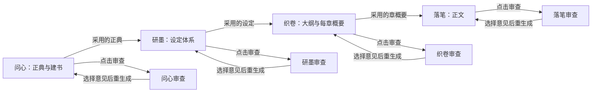

# 墨生万象：四 Agent 协作重构规划

日期：2026-09-08。状态：供讨论与后续实施的规划稿；本次未修改项目源码、配置或依赖，未创建提交。

审查基线：`qingyou0420/Inkborne`，`master` 提交 `4d0c0f5a53e733bace887e4169c15015a21ac482`，桌面版本 2.1.9。

审查方式：读取仓库源码、配置、相关测试及近期变更记录，追踪主要创作调用链。覆盖桌面架构、Studio 四步入口、聊天与模型选择、核心生成/审查/修订流程、文件存储及兼容逻辑。这是针对重构目标的静态审查，未逐文件审计全仓，未启动应用、安装依赖或运行测试，也未调用创作模型。因此，下文区分“已核实的代码现状”和“建议实现的目标”。

**目标：** 在现有本地桌面程序上，形成问心 → 研墨 → 织卷 → 落笔四个主 Agent；每步分别配置生成模型和审查模型，并支持用户主动审查、选择意见、重新生成、比较和采用成果。

**架构建议：** 保留 Electron、React Studio、Hono API 和 InkOS 内核。在 core 增加轻量创作工作流层，复用现有生成、检索、章节存储等能力；统一模型解析、成果版本和审查报告。四个主 Agent 通过已采用成果协作，在同一本书里顺序推进，也允许回到前一步修改。

**适用范围：** 个人、本地、小说创作。首轮围绕现有长篇书籍链路实施；支持一次规划全书，也支持按卷滚动细化。短篇已有独立流程，先保持兼容，再按实际需要接入。不会在这一轮同时重构剧本、互动影视、翻译、雷达等上游附带功能。

本文同时包含设计规格和分期实施任务。后续执行以用户确认的版本为准；本次交付到规划为止。

实施沿用仓库约束：项目根目录显式传入；引擎端口由桌面壳决定；不恢复旧 Next.js/IndexedDB 架构；保留现有许可证与上游署名。

## 1. 总体判断

项目已有较多可复用基础。当前主要问题是：**页面已经分成四步，实际业务调用、模型选择和成果生命周期尚未按四步统一。**

建议采用“保留底座、逐步拆分业务编排”的路线：

- 保留桌面壳、书架、四步导航、编辑器、大纲树、SSE 进度、模型服务库、本地文件、章节历史和检索能力。
- 把建书中的设定生成、基础审查和卷结构生成拆出去，分别交给研墨与织卷。
- 为四个主 Agent 建立独立的任务上下文、会话归属、成果范围、生成配置和审查配置。
- 把“生成成果”和“审查成果”拆成用户可分别操作的两件事，重生成直接使用所选报告。
- 以稿件保存、失败恢复、版本比较为必要工程重点；创作质量由作者最终判断。

评估过的路线：

1. **增量重构，推荐。** 新增工作流层，现有底层能力逐步成为四个 Agent 的内部操作。能保留已有书籍与成熟写作功能，每期都可独立验收。
2. **仅给四个页面增加 Prompt 和模型下拉框。** 改动较少，但建书仍包办多阶段，聊天和审查仍可能走不同模型入口，难以满足真正的职责独立。
3. **引入新的多 Agent 框架并重写核心。** 编排形式灵活，但要重新处理本地稿件、历史、长篇上下文和旧书兼容。当前个人用途没有足够收益支撑这项成本。

## 2. 已核实的代码现状

### 2.1 四步页面可以保留，Agent 分工需要落实到后端

Studio 已有 `BookAskPage`、`BookGround`、`OutlineWorkspace`、`BookDetail` 四个工作入口。问心通过 `BookAskPage` 包装通用 `ChatPage`；研墨主要是七段设定编辑与定稿；织卷调用大纲材料化；落笔调用写章及审校/修订工具。

证据：[App 路由映射](https://github.com/qingyou0420/Inkborne/blob/4d0c0f5a53e733bace887e4169c15015a21ac482/packages/studio/src/App.tsx#L52)、[问心包装通用聊天](https://github.com/qingyou0420/Inkborne/blob/4d0c0f5a53e733bace887e4169c15015a21ac482/packages/studio/src/pages/BookAskPage.tsx#L20)、[研墨固定指令调用 foundation/revise](https://github.com/qingyou0420/Inkborne/blob/4d0c0f5a53e733bace887e4169c15015a21ac482/packages/studio/src/pages/BookGround.tsx#L254)。

**重构含义：** 沿用四步页面和内部 `ask / ground / weave / write` 标识，为其连接独立的业务 Agent。无需重做一套导航，也无需把已有功能推倒。

### 2.2 现有建书包办了研墨和部分织卷

`PipelineRunner.initBook()` 先创建 `ArchitectAgent`，调用基础生成与 `FoundationReviewerAgent` 审查流程，再写设定、材料化卷结构，最后才把暂存书目录移成正式书籍。

这里需要准确区分：建书阶段会生成基础设定和卷结构；材料化的 `init` 模式只生成卷结构，**并非已经一次生成全书全部章概要**。后续织卷按批次补充章节。

证据：[initBook 生成与审查](https://github.com/qingyou0420/Inkborne/blob/4d0c0f5a53e733bace887e4169c15015a21ac482/packages/core/src/pipeline/runner.ts#L807)、[写设定与材料化卷结构](https://github.com/qingyou0420/Inkborne/blob/4d0c0f5a53e733bace887e4169c15015a21ac482/packages/core/src/pipeline/runner.ts#L837)、[init 仅返回 volumes](https://github.com/qingyou0420/Inkborne/blob/4d0c0f5a53e733bace887e4169c15015a21ac482/packages/core/src/agents/volume-map-materializer.ts#L330)。

**重构含义：** 新建书必须变成轻量保存操作。问心形成正典后即可创建书籍，研墨和织卷随后独立运行。`ArchitectAgent` 的现有输出覆盖故事框架、卷纲、人物、规则、初始伏笔，需要按成果职责拆开 Prompt 与生成方法。

### 2.3 已有工种模型覆盖，但尚不能直接当作八套完整配置

`ProjectConfigSchema.modelOverrides` 已支持按名称覆盖模型；对象形式包含 model、provider、baseUrl、apiKeyEnv、stream。它没有四步及各步审查的固定结构，也没有完整覆盖温度、思考参数、接口格式等字段。

`PipelineRunner.resolveOverride()` 在覆盖配置没有 `baseUrl` 时直接复用原 client。由这条分支可知，仅修改 provider、密钥来源或 stream，不一定建立对应的新调用配置。

证据：[模型配置 Schema](https://github.com/qingyou0420/Inkborne/blob/4d0c0f5a53e733bace887e4169c15015a21ac482/packages/core/src/models/project.ts#L109)、[resolveOverride 条件分支](https://github.com/qingyou0420/Inkborne/blob/4d0c0f5a53e733bace887e4169c15015a21ac482/packages/core/src/pipeline/runner.ts#L718)。

**重构含义：** 复用服务与密钥配置基础，建立统一的角色模型解析。八个入口必须真正控制请求，不能只是设置页有八张卡片。

### 2.4 聊天模型选择会影响项目默认模型

`ChatPage` 选择模型会调用 `/project/default-model`。服务端书籍聊天的模型绑定主要取会话覆盖或 Studio 默认值，而非问心等阶段角色配置。

证据：[聊天切换模型写项目默认值](https://github.com/qingyou0420/Inkborne/blob/4d0c0f5a53e733bace887e4169c15015a21ac482/packages/studio/src/pages/ChatPage.tsx#L444)、[服务端聊天模型绑定](https://github.com/qingyou0420/Inkborne/blob/4d0c0f5a53e733bace887e4169c15015a21ac482/packages/studio/src/api/server.ts#L5606)。

**重构含义：** 阶段页面改模型只更新该阶段生成配置。普通聊天仍可保留项目默认模型；四阶段运行统一取角色配置，避免问心切模型后意外改变落笔或审查。

### 2.5 手动章节审查存在单独创建默认模型的入口

`POST /books/:id/audit/:chapter` 直接用 `currentConfig.llm` 创建 `ContinuityAuditor`，没有使用管线的工种覆盖解析。

证据：[手动章节审查入口](https://github.com/qingyou0420/Inkborne/blob/4d0c0f5a53e733bace887e4169c15015a21ac482/packages/studio/src/api/server.ts#L6265)。

**重构含义：** 聊天、生成、手动审查、修订和后台恢复必须统一进入角色解析，尤其要把这个手动入口接到 `write.review`。

### 2.6 落笔已有手动模式，但“按报告修订”还没有稳定闭环

`chapterReviewMode === manual` 能跳过自动审查与重写循环，这是可以直接利用的基础。不过 `WriterAgent.writeChapter()` 本身仍包含状态结算，不能把“手动模式”理解为只产生一段正文文本。

另一方面，`reviseDraft()` 会先重新审查，因为章节索引只存字符串形式的审查问题。用户点击修订时，系统可能先得到一份新的问题集合，再据此修改，而不是直接使用用户刚读过的报告。

证据：[manual 分支](https://github.com/qingyou0420/Inkborne/blob/4d0c0f5a53e733bace887e4169c15015a21ac482/packages/core/src/pipeline/runner.ts#L2301)、[Writer 状态结算](https://github.com/qingyou0420/Inkborne/blob/4d0c0f5a53e733bace887e4169c15015a21ac482/packages/core/src/agents/writer.ts#L250)、[修订前再次审查](https://github.com/qingyou0420/Inkborne/blob/4d0c0f5a53e733bace887e4169c15015a21ac482/packages/core/src/pipeline/runner.ts#L1560)、[章节索引的 auditIssues 字符串数组](https://github.com/qingyou0420/Inkborne/blob/4d0c0f5a53e733bace887e4169c15015a21ac482/packages/core/src/models/chapter.ts#L21)。

**重构含义：** 保存独立、结构化且有版本绑定的审查报告；修订接收指定 reportId、成果版本和作者选择的意见。审查与正文状态结算分开处理。

### 2.7 本地数据基础适合扩展，不需要换数据库

现有数据包括书籍 JSON、正典和设定 Markdown、正文与章节索引、JSONL 会话，以及本地 SQLite 记忆检索。`MemoryDB` 的文件注释明确 Markdown truth files 仍为主要来源。

已有 SHA256 内容版本的正典变更提案、章节 `.versions` 历史和状态快照。这些可用于新成果的采用、冲突检测与恢复。

证据：[正典提案及内容版本](https://github.com/qingyou0420/Inkborne/blob/4d0c0f5a53e733bace887e4169c15015a21ac482/packages/core/src/interaction/truth-proposals.ts#L62)、[章节历史目录](https://github.com/qingyou0420/Inkborne/blob/4d0c0f5a53e733bace887e4169c15015a21ac482/packages/core/src/state/chapter-workspace.ts#L134)、[状态快照](https://github.com/qingyou0420/Inkborne/blob/4d0c0f5a53e733bace887e4169c15015a21ac482/packages/core/src/state/manager.ts#L872)、[记忆数据库的来源说明](https://github.com/qingyou0420/Inkborne/blob/4d0c0f5a53e733bace887e4169c15015a21ac482/packages/core/src/state/memory-db.ts#L1)。

**重构含义：** 正文与创作资料继续使用文件；增加少量 JSON 元数据记录成果、审查和任务。复用已有 SQLite 检索，无须引入新的向量数据库、服务器数据库或消息队列。

### 2.8 旧的“完成”判定不能直接用于新流程

当前阶段状态会结合文件存在、确认时间和已有章节进行推断；完整书籍判定仍要求规则、状态、伏笔及故事框架/卷纲等文件。新流程允许问心后先建书，这时研墨和织卷产物合法地尚不存在。

证据：[阶段推断逻辑](https://github.com/qingyou0420/Inkborne/blob/4d0c0f5a53e733bace887e4169c15015a21ac482/packages/studio/src/lib/book-stage.ts#L111)、[完整书籍目录判定](https://github.com/qingyou0420/Inkborne/blob/4d0c0f5a53e733bace887e4169c15015a21ac482/packages/core/src/state/manager.ts#L914)、[建书状态依赖基础设定完整性](https://github.com/qingyou0420/Inkborne/blob/4d0c0f5a53e733bace887e4169c15015a21ac482/packages/studio/src/api/server.ts#L3429)。

**重构含义：** 分开表达“书籍存在”“该阶段已有成果”“作者已采用”“是否已有审查”“当前内容可供下一步使用”。迁移时允许旧书保留原来的状态推断，新书依据工作流记录判断。

### 2.9 改造时应限制继续向大文件堆逻辑

此基线的 `pipeline/runner.ts` 约 4,157 行，Studio `api/server.ts` 约 7,742 行，`agent-tools.ts` 约 4,113 行。新增四步业务应放进独立模块，旧入口只保留适配调用。拆分围绕本次触及的职责进行，不安排全仓统一重写。

## 3. 四 Agent 的目标职责

四个 Agent 是四个明确的创作角色。各自持有角色说明、当前任务、自己的对话、引用资料和成果；共用运行器与文件服务。协作通过采用的成果和明确的修改请求完成。

各步审查器是按需调用的独立角色：有自己的提示词、模型配置、检查维度和报告。它读取成果并提出建议，不直接替作者修改稿件。

图中八个节点各有独立模型配置。箭头表达成果交接；后续 Agent 同时读取相关的全部上游资料，而非只读取紧邻一步。

### 3.1 问心：把想法变成故事正典，并创建书籍

**输入：** 用户聊天、创作偏好、参考材料，以及已有构思。通过自然对话逐步了解，不强制套用题材模板或一次填写长表。

**应形成的正典：**

- 书名或暂定书名，一句话故事，核心故事梗概。
- 核心主题、情绪基调、叙述视角与期望风格。
- 主角是谁、想得到什么、主要冲突和故事驱动力。
- 世界的基本前提，以及作者明确要求保留的设想。
- 故事走向、结局意向，预计篇幅或章节数量。
- 作者的必写点、避开项，以及仍可在后续决定的问题。

正典确定“这本书要讲什么”。人物详细档案、地理势力、力量细则等交由研墨展开。未决定的内容单独列为待定项，允许作者保留悬而未决的结尾。

**操作：** 聊天 → 生成/更新正典草稿 → 可选审查 → 修改或重生成 → 采用正典并建书。

**问心审查：** 核心冲突是否成立、动机是否支撑长篇、主题与走向是否相容、是否偏离用户原意、哪些信息缺失。把“与用户明确要求冲突”和“编辑个人偏好”分开写。

**重生成：** 根据作者所选意见更新正典，可只改梗概、冲突或结局意向；保留被标记为保留的设想。建书后再修改问心，更新原书正典，不能再次创建一本重复书。

### 3.2 研墨：建立完整设定体系，并逐项打磨

**输入：** 已采用正典、作者补充、已有设定及选择的参考材料。

先生成“本书设定目录”，再分项完成。目录根据小说需求扩展，不把“所有设定”硬编码成七个界面区块，也不要求每本书都包含修炼等级或国家战争。

**设定范围：** 世界与时代、地点、组织势力、人物与人物弧线、关系网络、力量/资源/职业体系、重要物品、历史事件与时间线、社会文化、叙事规则、专有名词，以及本书需要的其他类别。

人物的初始状态与后续章节中的动态状态要区分。例如“开篇尚未掌握某能力”是初始设定，写到第八章已经掌握是连载状态。

**操作：** 根据正典列目录 → 生成全部设定或选定分类 → 手工/对话打磨 → 可选审查 → 按意见重生成 → 采用设定。

**研墨审查：** 是否遵循正典；人物动机与关系是否成立；世界规则是否互相矛盾；能力上限和代价是否一致；重要设定能否支持故事发展；是否有重复、缺口和无用堆砌。

**重生成：** 支持某人物、某势力、某条规则或整套设定。跨人物的审查需读取相关关系与正典，不能只看单张人物卡。未选范围保持原样。

“全部生成”可在后台分批执行，保存已完成分类并支持继续；界面显示覆盖进度。部分完成不能显示为“全部设定已生成”。作者仍可采用当前已有设定开始规划。

### 3.3 织卷：组织全书大纲，并覆盖每章概要

**输入：** 用户本次规划需求、已采用正典、相关设定、已有大纲；连载中的书还要读取已写章节摘要和实际进展。

**成果层级：**

1. 全书大纲：开端、发展、转折、高潮、终局与主要叙事线。
2. 分卷或故事弧：本段目标、人物变化、核心事件、伏笔安排和节奏。
3. 每章概要：章名、视角、时间地点、目标、主要事件、冲突与转折、人物关系变化、设定引用、伏笔埋设/回收、结尾衔接及预计长度。

**必须支持全书覆盖：** 用户选择“规划全书每章概要”，系统便分批完成目标章数，而不是只给前十章。已有十章批次和失败续接能力可作为内部机制；提供“本卷”“指定章节范围”“补齐剩余章节”选项。

章节数未定时，先产出可调整的章数建议；采用后再生成全量概要。批次之间携带总纲和之前批次摘要，并在全量完成后提供一次整体审查，检查跨卷因果和伏笔。

**织卷审查：** 主线与人物弧线完整度、情节因果、节奏、重复桥段、突兀转折、伏笔闭合、章节衔接，以及对正典和设定的偏离。局部审查与全书审查分别显示覆盖范围。

**重生成：** 支持一章、一段章节、某卷或剩余大纲。已有正文的章节默认作为事实参考；修改大纲时显示影响，不自动重写已完成正文。

### 3.4 落笔：按规划写作，并维护可用的连载上下文

**输入：** 本章用户要求、正典关键约束、相关设定、全书/本卷定位、本章概要、前文相关正文与摘要、当前人物状态、待回收伏笔。

**成果：** 正文候选稿，以及由同一版本正文生成的摘要、状态变化和伏笔变化。正文是用户主要阅读对象，辅助产物默认收起。

**操作：** 选章或写下一章 → 输入本章偏好 → 生成草稿 → 可选审查 → 选意见局部修改/整章重写 → 比较版本 → 采用章节。

**落笔审查：** 正典/设定一致性、对本章概要的完成度、人物声音、视角、时间空间连续性、语言表现、重复赘述、节奏与结尾效果。规则型检查可复用现有代码；有成本的模型审查只在用户启动后发生。

**重生成：** 支持选段修改、按问题修改、整章重写、只调整文风。默认保留未选择区域和手工修改；整章重写先产生新候选稿，由作者比较后采用。

**状态处理：** 新草稿的摘要/状态只对该候选版本有效。采用正文时一并采用对应状态结果；废弃草稿不能污染下一章的记忆。若采用后重新改写早期章节，从受影响章节起提示重新核对摘要与状态，不静默删除后文。

## 4. 八套独立模型配置

固定八个逻辑位置：

- `ask.main`：问心生成/对话；`ask.review`：问心审查。
- `ground.main`：研墨生成/打磨；`ground.review`：研墨审查。
- `weave.main`：织卷规划；`weave.review`：织卷审查。
- `write.main`：落笔生成/修订；`write.review`：落笔审查。

“独立”指分别保存和解析配置，允许使用同一模型，也允许八个位置全部不同。共用模型服务和密钥并不影响角色独立；一个角色的选择不能自动改掉另外七个。

### 4.1 配置内容

基础项为服务/连接、模型、流式输出和角色说明。高级项包含模型支持的温度、思考参数、接口格式，以及按现有 provider 能力控制的上下文与输出预算。不要把当前已移到 provider 模型能力层的 `maxTokens` 旧字段原样重新塞回全局配置。

服务地址、认证与通用连接设置继续使用现有服务库和 `.inkos/secrets.json`。角色只引用服务；确需不同密钥或接口地址时使用不同连接配置。日志和成果元数据不保存密钥。

每个阶段页可看见“生成模型”和“审查模型”，并跳转编辑。设置页以四行呈现，每行两组配置。提供一次性“从现有配置填充”和“复制到另一角色”，复制后两份值独立。

### 4.2 统一解析规则

第一期采用简单规则：本次运行显式指定的临时覆盖 → 对应角色配置。迁移时把旧默认配置复制进缺失角色，避免每次运行暗中回退到变化中的全局默认值。

每次运行记录实际的服务、模型、有效参数及角色说明版本。模型配置缺失或失效时，明确显示是哪一个角色需要配置；不悄悄换模型。具体品牌型号留给作者选择，本规划不绑定某一厂商。

书级覆盖可在后期按需要增加，首期不同时引入项目、书、卷、章、会话多层继承。临时覆盖在界面上明确标识，不写回其他角色。

### 4.3 内部辅助调用也必须归属明确

当前底层可能调用 architect、planner、composer、writer、reviser、状态结算等多个工种。对新四步流程，按工作归属绑定：

- 生成和修订内部调用使用当前阶段的 `.main`。
- 该阶段显式审查及其内部模型判断使用该阶段的 `.review`。
- 正文摘要与状态提取是落笔的成果整理，沿用 `write.main`；确定性的文件检查不调用模型。
- 用户未启动审查时，不在后台以旧 `auditor`、`foundation-reviewer` 等名称另跑文学审查。

这样可以保留底层专用能力，同时保证用户配置的八个角色就是实际调用的依据。

## 5. 通用成果—审查—重生成闭环

四个页面共享同一套交互语义：

**输入要求 → 生成候选成果 → 手工编辑或点击审查 → 查看报告并选择意见 → 按意见重生成 → 比较 → 采用。**

审查可跳过。生成完成后即可阅读、保存和采用；质量评价不成为强制审批。审查失败只影响本次报告，不能把已保存的稿件一起变成失败。

### 5.1 两种“完成”必须区分

- **生成完成：** 本次任务已产出可阅读成果。
- **已采用：** 作者选择这一版作为后续步骤的依据。

审查状态单独显示为“未审查 / 审查中 / 有报告 / 报告对应旧版本”。不再把未审查简单表示成审查不通过，也不把进入后续页面视为前面已审查。

主操作保持少量：生成、审查、按意见修改、采用并继续。局部重生成、版本比较、导出放在成果相关位置，避免所有工具一次堆在顶栏。

### 5.2 审查报告的最小内容

- 报告 ID、阶段、审查范围、时间及实际审查模型。
- 被审成果 ID/版本，审查时引用的正典、设定、大纲版本。
- 总体评语和需要作者决定的事项。
- 每条问题的稳定 ID、所在条目/章节/段落、原文证据、原因、修改建议。
- 重要程度使用“优先处理 / 可改善 / 风格建议”等编辑语言。
- 能确定时附建议修改范围；不可靠的定位应退回条目或章节，不能假造精确行号。

报告是持久化资料，不放进“当前任务”单个快照里覆盖。现有 `task-store.ts` 主要按会话保存当前任务，用于状态恢复；历次成果和报告另行保存。

### 5.3 重新生成怎样使用报告

作者勾选意见，也可补一句自己的要求。提交时带上 reportId、原成果版本、选择的问题 ID、修改范围，以及需要保留的内容。

由原来的主 Agent 生成新候选版本；审查器负责指出问题。默认修改所选范围，整篇/整套重写需要作者主动选择。完成后显示原稿与新稿差异，以及“本次尝试处理了哪些意见”。这一列表是生成方的处理说明，不冒充独立复审结论。

作者可以再点审查获得新报告，系统不自动无限循环审查和重写。

如果用户在审查后手工修改了成果，旧报告保留并标成“基于旧版本”。可重新审查；也可显式选择“沿用这些建议”，以当前稿为基线再生成候选。旧建议不能静默覆盖最新手改。

### 5.4 上游变更的影响提示

例如问心把主角动机从“报仇”改为“救人”：

- 研墨提示相关人物动机和关系可能需要调整。
- 织卷提示相关卷章概要依据的是旧正典。
- 落笔显示已写章节可能受影响，并保留原文。

第一期使用简单、确定的版本依赖：正典变了，则下游成果显示待核对；单个人物卡变了，优先提示引用该卡的任务。尚无精确引用信息时标记较大范围，并说明依据发生变化。

作者可保留当前成果、重新生成受影响部分，或确认仍然适用。不要因上游一处改动强制把全书退回第一步，也不要假定模型能够准确判断所有影响。

## 6. 数据设计：沿用文件，补充轻量元数据

以下路径为拟议方案，并非当前仓库已经实现的文件结构。

### 6.1 正式创作资料的归属

- `books/<id>/book.json`：书籍元信息；书名等基础属性继续由此提供。
- `story/canon.md`：新增，问心采用的故事正典。只保存高层前提与创作目标，不复制整套设定。
- `story/author_intent.md`：保留用户原始意图与创作偏好，作为可追溯的输入。
- `story/story_card.md`：若继续保留，则作为正典与书籍元信息的摘要视图，由程序更新，避免第二份可独立修改的正典。
- `story/settings/index.json`：新增，本书设定目录，列出分类、条目 ID、对应文件与完成情况。
- `story/settings/*.md`：新增，用于地点、势力、历史等扩展类别。
- `story/roles/**`：沿用人物卡。设定目录引用人物卡，不再保存一份重复人物正文。
- `story/book_rules.md`：研墨维护的规则卡，设定目录直接引用；不在 settings 里再复制一份规则正文。
- `story/outline/story_frame.md`：新工作流中改为兼容输出，由正典和相关设定生成，供尚未迁移的旧读取入口使用。主题与冲突的权威来源是 canon.md；世界细节的权威来源是设定条目。阶段页面的编辑回到各自来源，不能把这份兼容输出再当作独立正典修改。旧书未接入新工作流时继续按原规则读取，不直接改变其文件含义。
- `story/outline/volume_map.md`：保留现有大纲树格式，作为织卷卷章规划的主要载体；具体章节概要沿用现有树节点及解析能力扩展。
- `chapters/*.md`、`chapters/index.json`：继续存正文与章节索引；正文历史复用 `.versions`。
- `story/state/**` 与现有摘要、伏笔文件：记录已采用章节的连载状态；SQLite 继续服务检索。

新布局的 `canon.md` 优先级与读取方式必须在统一读取器中定义。旧书没有它时从已有作者意图、故事卡和框架构造兼容视图；不让每个 Agent 各自推测来源。

采用的 `canon.md` 与 `book.json` 分别负责叙事前提和书籍元信息；正典预览中的书名从元信息读取。外部修改兼容输出时先保留修改副本并提示归入对应来源，不能直接用下一次投影生成覆盖作者改动。

### 6.2 工作流记录

建议在书内新增 `story/workflow/`，包含：

- `manifest.json`：工作流版本、各阶段采用的成果、当前候选、生成覆盖范围、需要核对的依赖。
- `runs/<runId>.json`：任务输入引用、阶段/操作、实际模型、状态、进度、错误、产生的成果 ID；较长资料引用快照文件。
- `artifacts/<artifactId>/`：生成或手工编辑的版本元数据与相关文件快照。以被改动的成果范围保存，不每次复制整本书。
- `reviews/<reportId>.json`：绑定明确成果版本的结构化报告。

尚未建书的问心草稿暂存在项目 `.inkos/authoring-drafts/<draftId>/`。采用正典并建书时关联已有会话，移动或登记草稿资料；重复点击用同一草稿 ID 返回已创建书籍。

每份成果至少包含阶段、范围、版本、父版本、来源（生成/手改/导入）、输入成果版本、文件列表和创建时间。只记录这些必要关联，无需引入通用事件溯源系统。

候选稿与正式文件的关系只有一条：候选用于比较和审查，作者采用后原子更新正式文件与 manifest。撤销采用创建一次新的采用记录，并恢复对应内容，不抹掉历史。

### 6.3 会话与上下文

现有 JSONL 会话继续使用，新增阶段归属；按书籍/建书草稿 + stage + sessionId 查询。每一步都能提出补充要求，问心承载主要构思对话，其余步骤围绕成果修改。

四个主 Agent 共享已采用资料，但不共享一条不断膨胀的聊天历史。跨阶段传递明确成果、用户要求摘要、引用与待定项；审查器只读取审查任务所需材料，无需继承生成者整段推理过程。

长篇上下文装配顺序：本次任务和正典关键点 → 本章/本卷规划 → 相关人物与设定 → 最近章节状态 → 检索到的前文证据。复用现有本地检索和上下文治理；预算不足先压缩远期摘要，关键约束不能无提示被截断。

## 7. 代码结构与复用落点

建议新增的模块均是未来实现任务；本次未创建以下源码文件。

### core 中增加 authoring 目录

- `packages/core/src/authoring/types.ts`：四阶段、八角色、运行、成果、审查报告和覆盖范围的类型及校验。
- `authoring/model-config.ts`：角色配置读取、旧配置导入、完整有效模型解析与运行快照。
- `authoring/store.ts`：成果、报告和任务记录的本地读写；复用原子文件集能力。
- `authoring/context.ts`：按阶段和目标范围装配上下文，统一新旧正典读取。
- `authoring/workflow.ts`：生成、审查、按报告修订、采用、取消的公共入口，以及阶段协作。
- `authoring/stages/ask.ts`：构思对话、正典生成及轻量建书。
- `authoring/stages/ground.ts`：设定目录、分项生成与局部打磨。
- `authoring/stages/weave.ts`：全书/卷/章规划、分批运行及恢复。
- `authoring/stages/write.ts`：正文候选、局部改写与采用后状态更新。
- `authoring/review.ts`：四类审查提示词和结果标准化，共用存储及范围处理。

四步自己的 Prompt 与业务适配放在各自模块附近。公共工作流只负责生命周期，不继续累积四步所有 Prompt 和业务判断。

### 复用现有能力

- `agents/architect.ts`：拆解现有基础生成 Prompt/解析；研墨复用世界、角色、规则能力，织卷接管卷纲职责。
- `agents/foundation-reviewer.ts`：复用检查维度和解析，分别形成问心/研墨/织卷的审查任务输入；避免一份大报告笼统评审全部阶段。
- `agents/volume-map-materializer.ts`、`utils/volume-map-tree.ts`：保留树结构、章节范围、批次与恢复；把“补全所有章”的调度交给织卷。
- `agents/planner.ts`、`agents/composer.ts`：织卷负责章节意图与概要。落笔可保留把既有概要细化成场景提示的内部动作，但不能偷偷替换织卷已采用的大纲。
- `agents/writer.ts`、`agents/reviser.ts`：复用生成与修改方法；把调用结果先交给候选成果存储，复用独立 `settleChapterState()` 能力处理采用稿。
- `agents/continuity.ts`：复用落笔审查维度，接入 `write.review` 和新报告存储。
- `interaction/truth-proposals.ts`、`utils/atomic-file-set.ts`、`state/chapter-workspace.ts`：复用差异、版本和原子写入；一次“采用”统一处理这一组文件，不为每个文件再增加审批步骤。
- `production/harness.ts`、Studio `api/task-store.ts`：复用运行状态与进度基础；通过 runId 关联历史记录，避免单个会话任务槽位承担所有成果版本。

### Studio 的改造

新增 `api/authoring-routes.ts` 承接新工作流接口，`server.ts` 只注册路由并适配旧调用。建议提供运行生成/审查/修订任务、读取运行、取消、列出成果/报告、采用成果等明确操作；都返回统一 runId。

公共界面模块包括阶段模型选择、成果版本比较、审查面板、意见勾选、任务进度。四个页面保留各自编辑方式：问心正典预览、研墨分类设定、织卷树与章概要、落笔正文。

`store/chat`、`api/resolve-agent-model.ts` 需要接入阶段字段与统一模型解析；`lib/book-stage.ts` 和 `book-stage-io.ts` 接入工作流状态；`use-book-stage` 与 SSE 刷新应以同一本书的 runId/成果变化为依据。

## 8. 分期迭代任务

推荐按以下六个里程碑推进。每一期交付可验证的用户行为；旧书兼容从第一期开始覆盖，不留到最后一次集中处理。版本号与每期发布范围在实施时确定。

### M0：工作流基础与模型配置统一

**结果：** 八个角色配置真实生效，新成果/审查/任务可保存，现有创作流程继续可用。

**修改范围：** core `models/project.ts`、`utils/effective-llm-config.ts`、新 `authoring/types.ts`、`model-config.ts`、`store.ts`；Studio 模型设置页、`resolve-agent-model.ts`、`task-store.ts`、新工作流路由。

- [ ] 定义八角色配置，导入旧 default 与 modelOverrides，不覆盖原配置备份。
- [ ] 建立统一解析器，补全 service、model、接口格式、流式和有效采样参数；检查实际请求结果。
- [ ] 为生成、审查、修订建立 runId、成果版本、reportId 和取消/失败记录。
- [ ] 实现候选保存、比较、采用以及依赖版本记录；复用原子写入和书锁。
- [ ] 新增共用模型配置和成果/审查面板，并接通一个可测试的阶段适配入口。

**验收：** 用八个可识别的假模型配置验证每个角色请求参数；修改问心配置不改变其他七项；报告重启后可读；请求失败保留旧成果；运行中切换设置不改变已开始任务的配置快照。

**对应测试落点：** 新 `core/src/__tests__/authoring-model-config.test.ts`、`authoring-store.test.ts`；扩展 Studio `api/resolve-agent-model.test.ts` 和配置界面行为测试。

### M1：问心独立，并完成轻量建书

**结果：** 聊天形成正典后即可建书；这一操作不调用研墨或织卷。

**修改范围：** 新 `authoring/stages/ask.ts`、`authoring/context.ts`；`interaction` 会话元数据；`BookAskPage.tsx`、`ChatPage.tsx`、`AskCreateRail.tsx`；建书 API、`create-status`、`state/manager.ts` 与阶段推断。

- [ ] 给问心会话记录草稿/书籍与阶段归属，取消阶段模型选择写项目默认值的副作用。
- [ ] 输出可编辑正典，接通问心审查与所选意见重生成。
- [ ] 实现一次性轻量建书：元信息、正典、控制资料和空章节索引。
- [ ] 把“书籍存在”与“完整基础设定”分开判断，保证合法的初始书籍不被认作失败目录。
- [ ] 阻止新流程再次调用旧 initBook 对同名未完成书目录执行清理；建书重试以 draftId/已有 bookId 续接。

**验收：** 研墨模型不可用时仍能完成问心建书；问心审查只调用 `ask.review`；连续点击建书只产生一本书；重开应用仍能看到尚未研墨的新书；修改已有书正典保持同一 bookId。

**对应测试落点：** 新 `authoring-ask.test.ts`、`authoring-book-create.test.ts`；扩展 `ask-page.test.ts`、`ask-artifacts.test.ts`、`book-stage.test.ts` 及相关 API 测试。

### M2：研墨独立，形成设定生成与打磨闭环

**结果：** 能从正典生成本书需要的全部设定，并单独审查或修改指定条目。

**修改范围：** 新 `authoring/stages/ground.ts`、`authoring/review.ts`；`agents/architect.ts`、`agents/foundation-reviewer.ts`；`BookGround.tsx`、设定目录与角色读取适配。

- [ ] 把 Architect 的设定生成拆为目录规划、条目生成和指定范围修订；移出卷纲生成。
- [ ] 建立设定目录，人物复用 roles 文件，其他类别可扩展。
- [ ] 接通研墨独立模型、审查、意见选择、新版本比较和采用。
- [ ] “生成全部”记录分类覆盖率和断点，失败从未完成项继续。
- [ ] 正典采用新版本后提示设定需要核对，保留已经手工修改的条目。

**验收：** 幻想与现实题材能形成不同目录；一次生成人物失败后其他已完成设定保留；仅重生成某角色时未选卡片逐字不变；审查不改设定文件；生成研墨内容不提前生成卷纲。

**对应测试落点：** 新 `authoring-ground.test.ts`、`authoring-review.test.ts`；扩展 `revise-foundation.test.ts` 作为兼容回归，并增加研墨页面实际交互测试。

### M3：织卷独立，完成大纲和全部章节概要

**结果：** 用户能规划全书每一章，也可仅规划某卷或某段，并按审查意见局部重排。

**修改范围：** 新 `authoring/stages/weave.ts`；`agents/volume-map-materializer.ts`、大纲解析与存储；`OutlineWorkspace.tsx`、大纲 API。

- [ ] 将总纲、卷纲和章概要的生成归入织卷，明确全书覆盖目标。
- [ ] 保留分批生成，新增父任务调度直到目标范围全部完成；断点记录已完成章与失败范围。
- [ ] 每章概要记录主要设定引用、人物变化和前后衔接，完善节点内容。
- [ ] 增加章/卷/全书审查，以及指定范围重生成。
- [ ] 改动已经写过的章节大纲时展示影响，正文不随之自动覆盖。

**验收：** 对一部计划 36 章的测试书，“全书规划”完成后 1—36 章无漏号、无重复，每章有概要；中途取消可从剩余章继续；只改 11—15 章保留其他章节；全书审查报告注明 36 章覆盖，而局部审查只声明其实际范围。

**对应测试落点：** 新 `authoring-weave.test.ts`；扩展 `volume-map-tree.test.ts` 和现有材料化测试；新增 Studio 大纲范围选择、续接、审查行为测试。

### M4：落笔接入统一审查与版本采用

**结果：** 按前三步写正文，用户点击独立审查，并基于这份报告得到可比较的新稿。

**修改范围：** 新 `authoring/stages/write.ts`；`agents/writer.ts`、`reviser.ts`、`continuity.ts`；管线手动分支和章节持久化；`BookDetail.tsx`、`ChapterReader.tsx`、audit/revise API。

- [ ] 新流程默认写完保存候选稿；文学审查由用户启动。
- [ ] 手动 audit 接入 `write.review`，将结构化报告完整保存。
- [ ] revise 接收选定报告/问题/范围，使用 `write.main`；移除这一新入口隐式重新审查的行为。
- [ ] 把正文候选的摘要和状态暂存到同一成果版本；采用时统一更新正式正文和连载状态。
- [ ] 支持选段修改与整章重写，保留手稿，提供版本比较及恢复。

**验收：** 生成正文不调用审查模型；点击审查只用 `write.review`；点击按报告修改不先多跑审查；废弃候选稿不会改变下一章人物状态；采用改写稿后阅读页、工作区、索引和摘要指向同一版本。

**对应测试落点：** 新 `authoring-write.test.ts`、`authoring-review-regenerate.test.ts`、`authoring-adopt.test.ts`；扩展章节历史、状态恢复和 Studio 内容刷新测试。

### M5：旧书接入与完整流程收敛

**结果：** 四步端到端可用，旧书可继续写，重复入口和旧调用差异得到收敛。

**修改范围：** `outline-paths.ts`、阶段迁移/兼容读取器、旧配置适配；四步导航与状态；受本次改造影响的旧 API、CLI/daemon 兼容入口；测试脚本。

- [ ] 选取旧平铺布局和现有 outline/roles 布局的书，执行兼容读取与工作流登记。
- [ ] 把历史文件登记为“已有成果/未在新流程审查”，不能伪造审查通过。
- [ ] 完成上游变化提示、早期章节改写后的状态重算或待核对标记。
- [ ] 在新四步流程中移除隐式自动审查的旧分支入口；旧 CLI/daemon 如保留自动模式，其行为独立且可预期。
- [ ] 整理重复接口与文案；为新行为加入持续运行的测试集合，而不是只沿用当前 CI 子集。

**验收：** 用同一套四步操作走完新书第一章；两个旧布局样本都能查看、导出、审查和续写；迁移前后正文内容与章数一致；关闭并重开应用可恢复任务结果与报告；旧自动任务不能在用户操作期间抢写同一本书。

## 9. 旧数据迁移与恢复

第一次接入新流程前为目标书和模型配置保存一次本地备份。迁移是登记和补充元数据，默认不让模型重新生成旧小说。

按现有读取器规则兼容旧 `story_bible.md / volume_outline.md / character_matrix.md` 和新 `outline/story_frame.md / outline/volume_map.md / roles/**`。同一信息有新旧两份时沿用现有优先规则，并在迁移预览中显示实际采用来源。

问心正典缺失时先提供由现有资料组合的可编辑兼容视图。需要模型提炼时由作者主动运行问心，不在打开旧书时自动调用模型。采用新的正典后保存 canon.md，并使后续读取统一使用它。

章节历史、状态快照和原始会话原样保留。历史会话可标为旧问心/旧通用会话，不根据聊天内容强行拆成四段。新的四步会话从阶段归属开始记录。

迁移中途失败不改正式正文，恢复后可以再次执行。重复运行迁移不能产生重复章节、重复目录或重置采用状态。

新工作流启用后，受影响的旧写入口应通过同一适配层落盘，不能形成“新工作流维护 manifest，旧入口直接改文件却不更新依赖”的双写路径。作者在外部编辑 Markdown 时，读取文件内容版本变化并登记手改版本，旧审查相应标记过期。

## 10. 个人本地使用的工程尺度

保留几件与稿件可靠性直接相关的基础措施：保存前检查数据可读、文件原子写入、同一本书的写入串行、取消与失败保留成果、采用前后版本可恢复、密钥留在本地现有配置中。

审查结论是编辑建议。用户可以跳过审查、忽略意见、接受待定设定，也可以直接调整上游正典。对不完整资料给出具体提示，允许带着作者明确的补充要求继续创作。只有无法调用模型、文件无法解析、存储失败等执行问题需要停止当前操作。

不纳入这一轮的内容：多人账号与权限系统、多租户、团队审批、计费和配额中心、远程 Agent 集群、消息中间件、企业审计留痕、云同步平台、模型自动竞标、无限自动互评。已有本地基础保护不必重做或刻意移除。

同一本书默认一次执行一个会修改内容的任务。审查读取固定快照，界面可以继续浏览。无需建立分布式锁；复用当前本地书锁，并避免后台守护任务与交互任务冲突。

## 11. 验证方案与最终交付标准

先用可控的假模型响应验证编排、配置、存储与恢复；真实模型只用于最后的内容体验验收。测试不需要每次支付八种模型调用成本。

必须覆盖的行为：

1. 八个角色分别使用指定模型和有效参数，服务相同也不会串配置。
2. 问心建书不调用研墨、织卷，重复点击不重复建书。
3. 每一步生成后都能单独审查、保存报告、按所选意见得到新版本。
4. 不审查也能采用；审查模型失败不会损失生成成果。
5. 报告绑定的版本可查；手改后不能把旧报告显示为对新稿的评审。
6. 局部重生成保留未选内容，采纳前不覆盖当前正式稿。
7. 全部设定、全书章概要的覆盖进度真实，批次中断后不漏项、不重复。
8. 正典改变后下游提示待核对，已有稿件仍可阅读和保留。
9. 正文、摘要、状态和索引在采用/恢复后保持同一版本关系。
10. 旧书两种布局与外部手改均能被正确读取，不伪造旧审查结论。
11. 关闭应用、取消任务、接口异常后能够看到已保存结果并继续。
12. 从新开问心到采用第一章的完整操作无需使用旧工具页补步骤。

仓库目前根 `pnpm test` 运行显式列出的 core/desktop/Studio 子集，不能把其通过等同于全量回归。后续实施应将新的 authoring 测试纳入默认集合，执行改动涉及的测试，再做构建和类型检查。根 `typecheck` 只覆盖 core 与 Studio server；涉及前端改动还需执行 Studio 包的完整 typecheck。需要 SQLite FTS5 的核心测试应使用具备该能力的运行时。

建议实施后的基础命令为 `pnpm test`、`pnpm build`、`pnpm --filter @actalk/inkos-studio typecheck`，并按改动补充相关 core 测试；Windows 桌面最终验收运行 `pnpm engine:smoke`，用新书和旧书样本手动走完四步。具体命令以实施时 package scripts 为准。本次没有执行这些命令，也不声称当前仓库测试通过。

**整轮完成的判断：** 作者能分别指定四位创作 Agent 和四位审查 Agent 的模型；每一步得到可编辑、可保留、可审查的成果；能选择报告意见重生成；下游准确使用采用版本；新书与已有小说均可在本地持续创作。

## 12. 优先顺序与仍需保留的设计余地

优先把三个基础问题处理好：模型真实独立、建书不再跨阶段包办、审查报告与稿件版本一一对应。它们决定后续四个页面增加的按钮是否有可靠业务支持。

目录分类、各步 Prompt 细节、是否使用同一厂商模型、分批默认大小、短篇何时接入，可以在相应里程碑结合实际写作体验调整。模型选择和文风评判不写死在架构里。

长篇创作中最重要的保留项是作者已写的内容与偏好。四个 Agent 应帮助作者逐步把故事写成，而不是要求作者反复通过复杂的流程检查。
